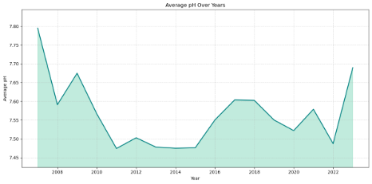
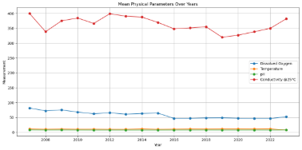
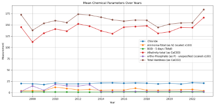
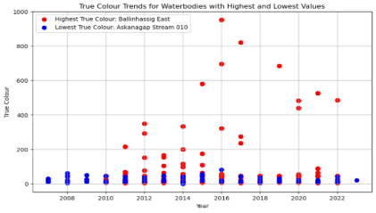
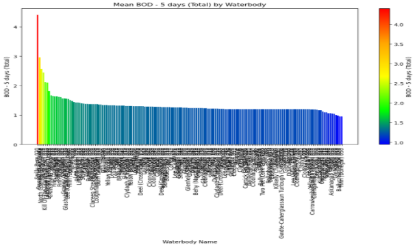
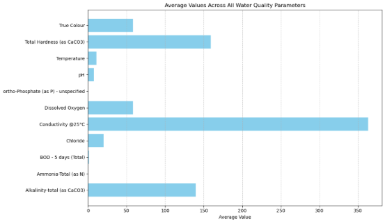
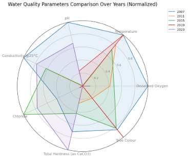
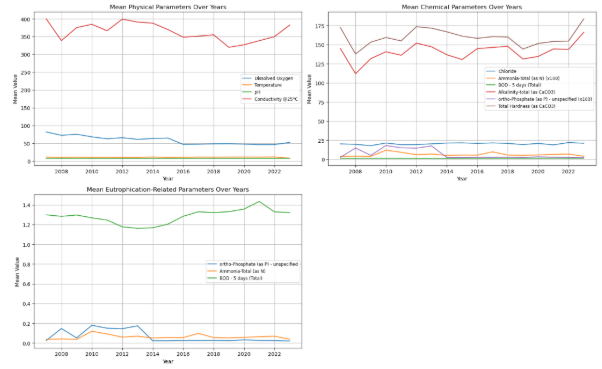
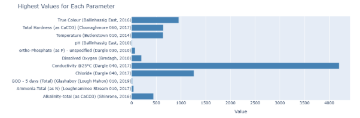

**Water Quality Monitoring**

Monitoring water quality is crucial for assessing the health of water bodies and ensuring that they are safe for ecosystems and human use.

This application demonstrates how to monitor water quality effectively, focusing on key parameters like pH, dissolved oxygen, and temperature, which are critical for water monitoring efforts.

**Datasets:**

The dataset includes 11 key water quality monitoring parameters.

Here’s an overview of the key parameters from the dataset and their importance in water quality monitoring:

- **Alkalinity-total (as CaCO3):** Measures water’s ability to neutralize acids, maintaining stable pH.
- **Ammonia-Total (as N):** Toxic at high levels, requiring careful monitoring to protect aquatic life.
- **BOD – 5 days (Total):** Measures the oxygen organisms need to decompose organic matter, indicating pollution levels.
- **Chloride:** Assesses water salinity and potential contamination from road salts or industrial discharge.
- **Conductivity @25°C**: Evaluates the ability of water to conduct electricity, indicating salinity.
- Dissolved Oxygen: Critical for aquatic life. Low levels suggest poor water quality.
- **ortho-Phosphate (as P):** Excess can lead to eutrophication, often measured to monitor nutrient levels.
- **pH**: Indicates the acidity or alkalinity of water, affecting biological processes.
- Temperature: Influences chemical reactions and the metabolic rate of aquatic life.
- **Total Hardness (as CaCO3**): Reflects calcium and magnesium levels, which are important for aquatic organisms.
- **True Colour**: Measures water color after filtering, often used to assess clarity and potential pollution.

**Area Chart – Average pH Over Years**

The area chart displays the fluctuations in pH levels over the years. pH is a critical measure for water quality monitoring, as it affects the biological and chemical processes within the water.

The pH levels remained mostly stable over time, with occasional dips indicating potential increases in acidity during specific years.\
\
**Spline Chart (Line Chart) – Physical Parameters Over Years**

The spline chart highlights how physical parameters such as temperature and total hardness have evolved over time. Physical parameters play a significant role in determining the suitability of water for various uses.

Temperature shows slight variations, possibly reflecting seasonal changes. Total hardness remains steady, suggesting that mineral content in the water is stable.

**Spline Chart – Chemical Parameters Over Years**

This chart highlights key chemical parameters such as chloride and dissolved oxygen levels. Note that two parameters have been scaled up by a factor of 100 to make their values more comparable to others in the chart. This scaling allows for a better visual comparison between parameters that naturally have smaller values.

Chloride levels remain stable, while occasional dips in dissolved oxygen levels may indicate potential periods of lower water quality, possibly due to pollution.

**Scatter Chart – True Colour Trends**

True colour is an indicator of water clarity, which is influenced by dissolved and particulate matter. This scatter chart visualizes the trends in true colour across different years and water bodies.

Sharp increases in true color values indicate potential pollution or increases in organic material affecting water clarity during certain years.

**Bar Chart – Mean BOD (Biological Oxygen Demand)**

BOD is an indicator of how much oxygen is needed to break down organic matter in water. This vertical bar chart displays the BOD levels across different water bodies, highlighting those with high organic pollution which are important parameters in water quality monitoring.

\
Some waterbodies show higher BOD levels, suggesting higher organic pollution, which may stress aquatic life.

**Bar Chart – Average Values Across All Parameters**

This horizontal bar chart gives an overview of the average values for each water quality monitoring parameter. It provides a clear understanding of which parameters were most prominent across the dataset.

The chart highlights high conductivity and chloride levels, which may point to salinity concerns. Ammonia and ortho-Phosphate show up as 0 due to their very low average values, which round down to zero in the visualization, while other parameters like pH and dissolved oxygen remain within acceptable ranges.

**Spider Chart – Water Quality Parameters Comparison Over Years**

The spider chart offers a comparative view of different water quality monitoring parameters, allowing for a quick comparison of their relative levels across the years.

**Dashboard – Overview of the Water Quality Monitoring Parameters Over Years**

The following dashboard provides a consolidated view of water quality parameters, displaying trends across physical, chemical, and eutrophication-related indicators. Additionally, it highlights the highest values for each parameter, offering insights into the extreme measurements observed over the years. The code for this dashboard can be found in the water quality monitoring project’s notebook file.

**Conclusion**

By leveraging above Python analysis, this water quality monitoring project shows how we can efficiently monitor key parameters that determine the water quality in regions, e.g. Ireland, this includes water quality trends. This kind of water quality monitoring applications are critical for maintaining safe and healthy water bodies
